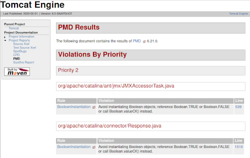

# Assignment 5: Dropje voor dropje kwaliteit

Sie sind jetzt in der Lage einen Tomcat zu bauen und mit den passenden Webanwendungen so zusammen zu stellen, dass er wieder ein komplettes Paket ergibt. Allerdings fliegen Sie aktuell komplett blind, was die Qualität der gebauten Ergebnisse angeht. Deswegen sollen im nächsten Schritt entsprechende Auswertungen zur Qualität des Quelltextes durchgeführt und ausgewertet werden.

## Testwerkzeuge

Schauen Sie sich die folgenden Testwerkzeuge an

  * [SpotBugs](https://spotbugs.github.io/)
  * [PMD](https://pmd.github.io/)

Informieren Sie sich über die Funktionsweise und welche Informationen man aus den Tools jeweils ziehen kann. Finden Sie heraus, wie man die jeweiligen Tools in Maven benutzen kann.

## Integration in Maven für den Engine-Build

Integrieren Sie die Testwerkzeuge als Plugins in Ihren Maven-Build für die Tomcat-Engine, die Webapps sollen Sie ignorieren. Maven besitzt das Target `site`, mit dem man eine Projektwebseite erstellen kann. Das Ziel ist, dass man nach Aufruf von `mvn site` unter `target` einen Ordner `site` findet, der eine vollständige Übersicht über die Testläufe etc. enthält. Damit man von den Ergebnissen der oben genannten Werkzeuge leicht zu den Quellen springen kann, sollen Sie das Maven-Plugin [JXR](https://maven.apache.org/jxr/maven-jxr-plugin/index.html) verwenden.

Integrieren Sie die folgenden Maven-Plugins in Ihren Build:

  * maven-pmd-plugin
  * spotbugs-maven-plugin
  * maven-jxr-plugin

Einen beispielhaften Satz von PMD-Regeln finden Sie in der Datei [pmd-rules.xml](pmd-rules.xml) - dieser ist aber sehr umfangreich und wird viele Fehler finden. Ändern Sie die Regeln so, dass nicht unnötig viele, triviale Abweichungen gefunden werden. Insbesondere `UnusedFormalParameter`, `UnnecessaryModifier`, `UselessParentheses` und `BooleanInstantiation` sind Meldungen, die Sie abstellen sollten. Bei den Ausnahmen sollten Sie leere Catch-Blöcke akzeptieren, wenn diese einen Kommentar enthalten (siehe `EmptyCatchBlock`).

Schauen Sie sich die Reports an und überprüfen Sie, ob sinnvolle Metriken gesammelt werden.

## Fehler beheben

Beheben Sie testweise eine Meldung im vorhandenen Quelltext von Tomcat und schauen Sie, ob sich die Metriken und Daten ändern.

## Beispiel für das Ergebnis

Wenn alles korrekt funktioniert hat, findet sich im `engine/target/sites`-Ordner eine Webseite. Öffnen Sie die `index.html` im Browser. Sie sollten folgendes sehen.



## Hinweise

Beachten Sie die folgenden Hinweise.

### Umgang mit Tests

Um die Arbeit an Ihrer Konfiguration zu beschleunigen, sollten Sie erst einmal die meisten Tests entfernen und nur mit einem kleinen Satz von Testklassen arbeiten. Wenn Ihr Build komplett durchläuft und auch die Reports sauber erstellt werden, können Sie wieder mehr Tests hinzunehmen.

Wenn Sie wieder alle Tests hinzugefügt haben, entfernen Sie wieder diejenigen Tests, die sehr lange laufen. Sinnvoll ist eine Gesamtlaufzeit der Tests unter 30 Sekunden.


### Fehlgeschlagene Tests ignorieren

Einige Tests schlagen sporadisch fehl, z.B. wei ein Port noch blockiert ist. Deswegen bietet es sich an, Maven zu sagen, dass der Build bei fehlerhaften Tests nicht abgebrochen werden soll. Dies können Sie mit folgender Konfiguration erreichen:

```xml
<plugin>
  <groupId>org.apache.maven.plugins</groupId>
  <artifactId>maven-surefire-plugin</artifactId>
  <version>3.0.0-M1</version>
  <configuration>
      <testFailureIgnore>true</testFailureIgnore>
      <useSystemClassLoader>true</useSystemClassLoader>
  </configuration>
</plugin>
```

### Spotbugs

Sie benötigen die neueste Version von Spotbugs (4.0.0), um mit aktuellen JDK-Versionen arbeiten zu können.

### Site-Plugins

Sie müssen Plugins für das `site`-Target nicht nur in der `plugin`-Sektion, sondern auch in der `reporting`-Sektion der `pom.xml` aufnehmen, damit die Reports der Tools auch während des `site`-Schritts zusammengestellt werden. Für `surefire` heißt das Reporting-Plugin nicht `maven-surefire-plugin`, sondern `maven-surefire-report-plugin`.

### JDK-Version

Wenn Sie ein JDK 14 einsetzen, sollten Sie trotzdem für maximal JDK 13 kompilieren, da es andernfalls zu Problemen mit manchen Plugins kommen kann. Setzen Sie daher zentral die folgenden Properties für Ihre Projekt:

```xml
<maven.compiler.source>13</maven.compiler.source>
<maven.compiler.target>13</maven.compiler.target>
```

### Site-Goal

Das Site-Goal ist nur im Projekt `engine` gültig. Rufen Sie es also im Unterverzeichnis `engine` auf und nicht im Hauptverzeichnis.

## Abgabe

_Abgabe_: Checken Sie den entsprechend umstrukturierten Sourcecode und die dazugehörigen `pom.xml` ein. Man sollte Ihr Repository einfach mit `git clone` clonen und mit `build.sh` (aus dem vorherigen Assignment) bauen können.
