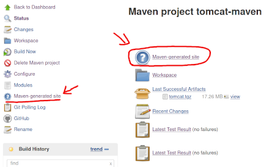
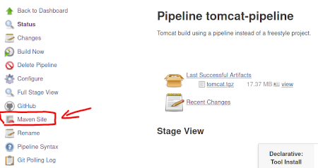

# Assignment 6: Ein Butler für Sie

Nach den vorhergehenden Assignments haben Sie jetzt einen modernen Build für Tomcat basierend auf Maven und entsprechenden Qualitätssicherungsmaßnahmen durch Tests und Code-Analysen. Was aktuell fehlt ist eine Automatisierung im Rahmen einer Continuous Integration (CI).

Als CI-Tool werden wir [Jenkins](https://jenkins.io) einsetzen und den Tomcat-Build damit automatisieren. Ziel ist, dass nach jeder Änderung in den Quelltexten

  * diese von GitHub geholt
  * gebaut
  * getestet
  * paketiert
  * und die Ergebnisse archiviert werden


## Jenkins installieren

Installieren Sie [Jenkins](https://jenkins.io) gemäß der Anleitung auf der Webseite auf Ihrem Server. Sie können Jenkins entweder direkt auf der Maschine oder mit Hilfe von Docker installieren. Beachten Sie aber, dass Sie im folgenden Assignment einen Docker-Container mit Tomcat erstellen müssen und diesen starten. Das Starten von Containern aus Containern ist möglich aber [nicht unproblematisch](https://jpetazzo.github.io/2015/09/03/do-not-use-docker-in-docker-for-ci/), sodass Sie Jenkins besser direkt auf Ihrem Server installieren sollten.


## Tomcat mit Maven-Projekt bauen

Legen Sie in Jenkins ein Maven-Projekt `tomcat-maven` an und konfigurieren Sie es so, dass bei jeder Änderung an den Sourcen ein Build des Tomcat startet. Wenn Sie den Projektyp nicht sehen, müssen Sie zuerst das das richtige Jenkins-Plugin namens `Maven Integration plugin` installieren.

Am Ende des Durchlaufs sollen die erzeugten Artefakte in einem einzelnen Archiv (tgz oder ZIP) archiviert werden. Hierzu müssen Sie ein Shell-Skript in den Build einbinden. (Es entspricht weitestgehend dem schon programmierten `build.sh` aus dem Assignment 4 und 5)


## Tomcat mit Pipeline bauen

Erstellen Sie jetzt ein zweites Jenkins-Projekt `tomcat-pipeline`, das ebenfalls Tomcat baut, tested und assembliert allerdings dazu eine Pipeline (d.h. ein `Jenkinsfile`) verwendet. Diese Pipeline (das Jenkinsfile) sollte dann auch zusammen mit dem Projekt eingecheckt werden.

Zerlegen Sie die Pipeline in sinnvolle Schritte, z.B.

  * Checkout
  * Build
  * Test
  * Reports
  * Assemble

Am Ende des Durchlaufs sollen die erzeugten Artefakte archiviert in einem einzelnen Archiv (tgz oder ZIP) archiviert werden.

Um die Qualitätsreports an einer Stelle zu erhalten, müssen Sie neben `mvn site` auch noch `mvn site:stage` ausführen.


## Abgabe

_Abgabe_:

  * Erstellen Sie eine kurze Dokumentation, was Sie gemacht haben und checken Sie die notwendigen Konfiguationsdateien in Ihr Projekt ein. Ein fachkundiger Dritter sollte in der Lage sein, anhand Ihrer Anleitung einen Jenkis für Ihr Projekt aufzusetzen.
  * Legen Sie in Ihrem Jenkins-Server einen User `thomas` mit dem Passwort `jenkins` an, der sich Ihre Ergebnisse ansehen kann.


## Hinweise

### Erkennen von Änderungen am Repository

Da Ihr Server hinter einer Firewall steht, können Sie keine GitHub-Hooks verwenden, um Änderungen zu erkennen. Verwenden Sie stattdessen "Poll SCM" als Build-Trigger und lassen Sie Jenkins alle _5 Minuten_ nach Änderungen im GitHub-Repo schauen.


### Zugriff auf das Repository

Ihr Repository ist auf GitHub nicht öffentlich, sondern privat. Deswegen müssen Sie

  * einen ssh-Key [generieren](https://help.github.com/en/github/authenticating-to-github/generating-a-new-ssh-key-and-adding-it-to-the-ssh-agent)
  * den Public-Key bei GitHub als "Deploy key" zu Ihrem Repository eintragen
  * den Private-Key in Jenkins als "Credential" hinterlegen.

Bitte verwenden Sie keinen bereits vorhandenen Schlüssel, sondern legen Sie aus Sicherheitsgründen einen neuen an.


### Reports

Denken Sie daran, dass im Rahmen des letzten Assignments wichtige Reports zur Qualität der Software generiert worden. Dies sollte auch im Jenkins-Build passieren und die Ergebnisse sollten in die Anzeige von Jenkins integriert werden.

Für den Build als Maven-Projekt funktioniert die Generierung der Seiten und die Einbindung automatisch.



Im Pipeline-Build können Sie das [HTML Publisher-Plugin](https://www.jenkins.io/doc/pipeline/steps/htmlpublisher) verwenden, um die generierte Maven-Site in Ihre Jenkins-Übersicht aufzunehmen.

```console
  publishHTML target: [
    allowMissing: false,
    alwaysLinkToLastBuild: false,
    keepAll: true,
    reportDir: 'target/staging',
    reportFiles: 'index.html',
    reportName: 'Maven Site'
  ]
```




### Keine Formatierung bei HTML-Seiten der Reports

Wenn Sie bei den Reports keine Formatierung sehen, dann liegt das an den Sicherheitseinstellungen von Jenkins. Details zur Lösung finden Sie [hier](https://stackoverflow.com/questions/35783964/jenkins-html-publisher-plugin-no-css-is-displayed-when-report-is-viewed-in-j).
