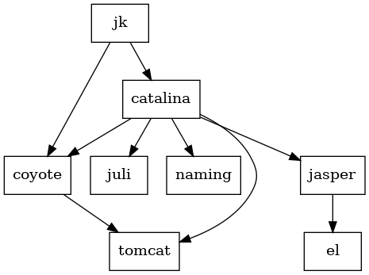

# Assignment 7: Architektur-Archäologie mit Indiana Jones

Ziel des Assignments ist es, die grobe Architektur von Tomcat zu analysieren und zu dokumentieren. Am Ende sollten Sie einen Überblick haben, der es Ihnen erlaubt, sich im Code von Tomcat zurecht zu finden und eventuell Änderungen daran vorzunehmen.

## Paketstruktur

Ein Einstieg in solch eine Analyse der *grundlegenden Struktur* ist bei Java-Programmen die Paketstruktur und die Abhängigkeit zwischen den Paketen. Diese lässt sich relativ einfach aus den `import`-Statements der Klassen extrahieren. Die Zugehörigkeit einer Klasse zu einem Paket ergibt sich direkt aus deren `package`-Statement am Anfang oder auch aus dem Pfad der Datei, der dem Paket entsprechen muss. Somit kann man die Paketabhängigkeiten rein textuell aus dem Quelltexten bestimmen.

Bei der Analyse der Abhängigkeiten wollen Sie möglicherweise die Standardbibliothek (`java.*`) ignorieren, damit Sie nicht in unnötigen Informationen ersticken.

Wichtige Werkzeuge für die manuelle Analyse der Quelltexte sind `sed` und `grep`, die Sie sich ansehen sollten.

Die Struktur können Sie mit Werkzeugen wie [Graphviz](https://www.graphviz.org) visualisieren. Schauen Sie im Internet, ob Sie noch andere Werkzeuge finden können, um die Aufgabe zu erledigen (z.B. [STAN](http://stan4j.com) oder [Structure101](https://structure101.com)).

_Erzeugen Sie ein Diagramm_, aus dem man die grundlegende Struktur der Pakete und deren Abhängigkeiten entnehmen kann. Die Darstellung sollte analog zur folgenden Grobstruktur von Tomcat sein, allerdings zusätzliche Detailebenen durch die Pakete enthalten.

Filtern Sie die Darstellung sinnvoll, d.h. entfernen Sie unwichtige Pakete.

_Dokumentieren Sie zu jedem Paket dessen grobe Aufgabe._

## Ablauf eines Requests

Versuchen Sie die dynamische Architektur von Tomcat bei der Request-Verarbeitung zu ergründen. Von besonderem Interesse ist, wie ein Request durch den Server läuft und verarbeitet wird, da dies ein Ablauf ist, in den wir später vielleicht eingreifen wollen.

Den *Ablauf eines Requests* können Sie am besten mit einem Debugger herausfinden, d.h. indem Sie eine eingehende Anfrage durch den Server verfolgen und entsprechend notieren, wie der Ablauf ist. Etwas erschwert wird diese Aufgabe dadurch, dass die Anfragen zwischen verschiedenen Threads weitergereicht werden.

*Tipp*: Setzen Sie einen Breakpoint in eines der Beispiel-Servlets und schauen Sie sich den Stack an, wenn der Breakpoint zuschlägt. Danach kennen Sie die Klasse, die den Request an das Servlet weiter leitet und können in einer deren Methoden einen weiteren Breakpoint setzen und von dort aus die Request-Verarbeitung analysieren.

*Tipp*: Tomcat verwendet intern ein Architekturmuster, das sich _Pipe and Filter_ nennt. Finden Sie heraus, wie dieses aufgebaut ist und durch welche Klassen es realisiert wird.

Zeichnen Sie ein Sequenz-Diagramm oder wählen Sie eine andere Adäquate Darstellung für die Request-Verarbeitung.

## Abgabe

_Abgabe_: Dokumentieren Sie die von Ihnen gefundene Architektur, die groben Aufgaben der Pakete und checken Sie die Ergebnisse in das GitHub-Repository Ihrer Gruppe im Verzeichnis `documentation` ein. Wählen Sie eine adäquate Darstellung (Text/Diagramm). Als Dateiformat wählen Sie bitte Markdown (.md), Text (.txt) und/oder Portable Document Format (PDF).
